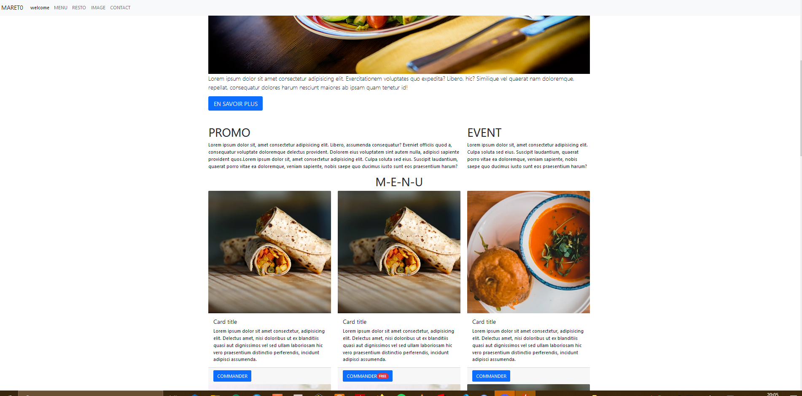
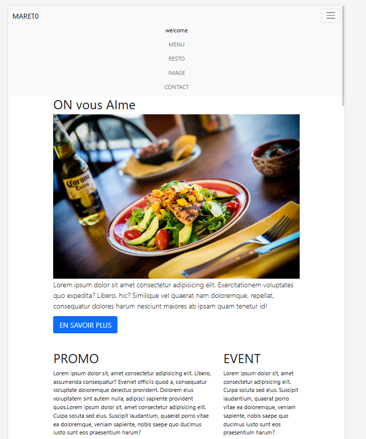

## RESTAURANT VITRINE RESPONSIVE
----------------------------------------

Bonjour, 

ce repos contient un site **en concstruction**, une vitrine pour un restaurant. Vous pourrez y trouver plusieurs pages responsives qui contiennent :
- le menu
- la gallerie photos 
- une page contact (formulaire email)
- toutes les infos du restaurant

Langages : HTML , CSS , BOOTSTRAP

STATUT : Le Design du site n'est pas encore etabli, par contre la structure du site est presque fini.

Liens des consignes : https://github.com/becodeorg/BXL-Swartz-5.34/blob/main/1.The-Field/10.Bootstrap/restaurant.adoc

les photos sont libres de droits et proviennent du sites https://www.pexels.com

 En Formation chez Becode en septembre 2021.

  

 